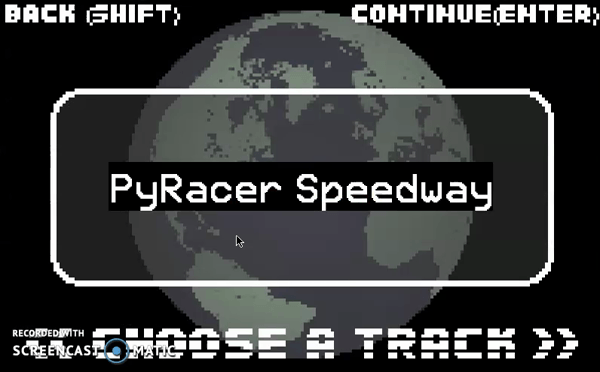
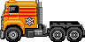
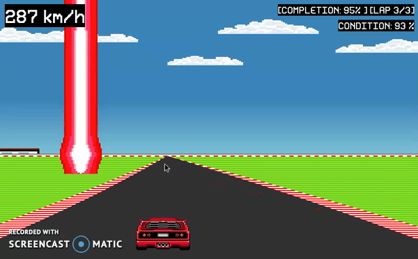

# PyRacer:   
    

## Running The Game:   
PyRacer was developed with Python 3 and requires Python 3.4 or higher installed on your machine to play. In addition to this, cross-platform support is available but on Windows all the necessary libraries must be visible to the directory where the game files are kept.   

- In order to run PyRacer you must have PyGame, as this is the library much of the code is based on.   

- To install PyGame run the following code that best fits your situation in your terminal:   

 - Globally on your OS- `python3 -m pip install -U pygame`   
 - For a singular user- `python3 -m pip install -U pygame --user`  

- Some other libraries that may need to be installed are `numpy`, `pathlib`, and `contextlib`.   

PyRacer was developed in Ubuntu and is designed to work on Linux and Mac OS, but can also run on Windows with the proper file specifications.   

Once PyGame is installed open the directory in which the game files are saved and run `python3 scripts/main.py` in the terminal of that directory.   

## Gameplay Overview:   
Here, we have a 2.5D car racing game, in which you have to drive your selected car through obstacles, and on the road in order to complete the track.   

The goal of this game is to beat all 6 stages to unlock the last car. Each stage of this racing game is a track, that a car that completes 3 rounds through a selected track chosen in the menu.   

For car choices, we have an option of the fastest car, but low durability, a medium speed car with medium durability, and a low speed car with high durability, and your objective is to complete the stage without your car getting destroyed.   

There are laser beams coming overhead which enact damage to your car if it comes into contact with the beams. We have turbochargers as icons, which signify the number of stages you have completed. A golden turbocharger means you have completed one of the six stages.   

In order to reset number of turbochargers and the saved game data, simply press "r" in the menu.   
In the folder, if you navigate to `data/gamedata/gamedata.txt`, you will see any collection of seven numbers that are either 0's or 1's, which represent the completion values of each course completed. Changing them all to 0, sets all courses as uncompleted.   

You also have different background music for each of the stages, as well as a HUD and stage completion indicator, giving you all the information you need to finish the stage.   
To toggle the music on or off at any time, press "m".   

To open the web-page for PyRacer's information (it will be a link to this page on GitHub), press "i".   

In summation, this game is a modern adaptation of the classic SEGA game 'Outrun', with a remix to the original game play where the you can choose between three different cars and race along 6 different courses. The primary objective of this game is to complete all six courses successfully, and if this goal is achieved you will be rewarded with the special fourth car. Below are the basic descriptions of each car.   

*P.S. If you have unlocked the special fourth car press "l" at any time for a surprise!*   

### The Sprinter:   
   

This car is the fastest but least durable.   

### The Sport-Utility:   
   

This car is somewhere in between in terms of speed and durability.   

### The Big Rig:   
   

This car is the slowest but most durable.   

### The ?????? ??????:   
   

???   

## Under The Hood:   
This game utilizes the PyGame library to accomplish several tasks; from rendering images and playing music to displaying the head-up display and handling user input. Used in accordance with object-oriented programming this game is brought to life.   
   

### Classes & Methods:   
There are five files and four classes that help create the game, with some handling the objects in the game and others handling the data the game uses.   

---
#### The `Player` Class & File:  
This `Player` class is used to display and update the player object (the car that the user controls).   

The `__init__()` function defines the source images for each car as well as some positioning and collision defaults.   
The `move()` makes the car move sideways.   

---
#### The `Road` Class & File:  
This `Road` class is used to display and update the road object (the simulation of forward movement in the game).   

The `__init__()` function defines the aesthetics of each road that can be rendered and pulls the appropriate track data to read from.   
The `update()` function defines how each slice of the road/ground/sidelines will render depending on self.tilt, and the index of the respective list.   
The `readtrack()` function reads through the track data file and dictates how the overall course will react on each frame switch.   

---
#### The `Laserbeam` Class & File:  
This `Laserbeam` class is used to display and update the laserbeam object (the obstacles that the user must avoid).   

The `__init__()` function defines the source image for the lasers and the possibilities of how the lasers will act, as well as some positioning and collision defaults.   
The `update()` function defines how the lasers will act depending on a random given number, and controls the speeds at which they move.   

---
#### The `TrackGenerator` Class & File:  
The `TrackGenerator` class is used to generate a list of numbers that will correlate to how the in-game road will operate.   
Each number from 1 through 5 will cause the road to act differently:   
1 - Road holds to the left.   
2 - Road turns to the left.   
3 - Road holds to the center.   
4 - Road turns to the right.   
5 - Road holds to the right.   

The `__init__()` function defines the possible pieces of the track that can be put together.   
The `generate()` function uses the predefined pieces for a track written with strings to make a complete track.   

---
#### The `KeyInput` Class & File:  
The `KeyInput` class is used to handle user input from the keyboard.   

The `read()` handles the game's reactions to the user's input.   

---
#### The `GlobalVariables` Class & File:  
The `GlobalVariables` handles the all the global variables in the game.   

The `__init__()` function initializes every single global variable that all the other objects can access during runtime.   

##### In addition to these classes there is the fundamental 'main' function.   

#### The `main` Function:   
The `main()` function is used to run the game, manage which objects render, and play music, along with saving data and pulling data to be read by the objects that need it.   
First all the objects are initialized and then in the following while loop all of the interactions (from user input, to collision detection, to the head-up display and UI) are handled.   
##### The while loop:   
Although dispersed, the while loop in this function can be split into three overall concepts: Graphics Rendering, User Input, and Collision Detection.   
Two of the three concepts are presented in the `ingame == False` statement while all three are presented in the `ingame == True` statement.   

## Usage Rights:
**Source Image Citations:**   
Car Sprites:   
Chase H.Q. II/Super H.Q. (Sega Mega Drive/Genesis); Ripped by Yawackhary; Developed by I.T.L.; Taito Corporation 1992.   

Lotus Turbo Challenge (Sega Mega Drive/Genesis); Ripped by Yawackhary; Developed by Magnetic Fields, Gremlin Graphics Software; Electronic Arts 1992.   

Music Sources:   
Lil Uzi Vert; "Lotus"; Eternal Atake (Deluxe); WMG (on behalf of Atlantic Records); Warner Chappell, Kobalt Music Publishing; Instrumental Remake By OBITX.   

Vivid Sound × Hybrid Colors: Sonic Colors Original Soundtrack; Wave Master.   

*All other source files were either royalty-free or made in-house.*

# System Diagram:   

