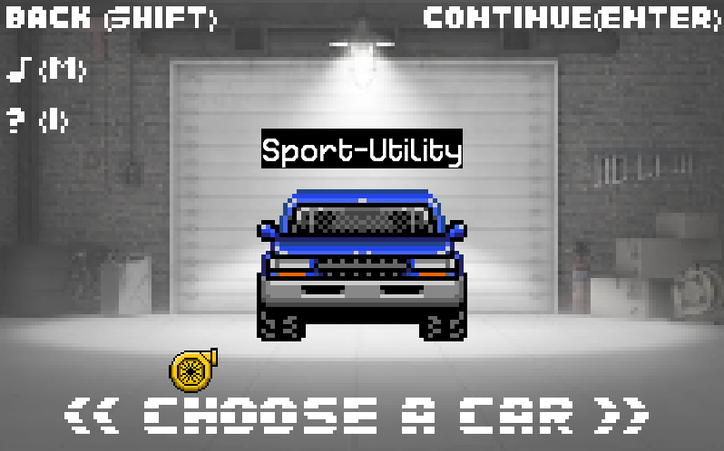
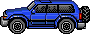

# PyRacer:   

   
   
## Running The Game:   
In order to run PyRacer you will have to first install Pygame, as this is the library much of this code is based on.   
To install run the following code that best fits your situation in your terminal:   
Globally on your OS- `python3 -m pip install -U pygame`   
For a singular user- `python3 -m pip install -U pygame --user`   
   
Once PyGame is installed open the directory in which the game files are saved and run `python3 scripts/main.py` in the terminal of that directory.   
   
## Gameplay Overview:   
Here, we have a 2.5D car racing game, in which you have to drive your selected car through obstacles, and on the road in order to complete the track.   

The goal of this game is to beat all 6 stages to unlock the last car. Each stage of this racing game is a track, that a car that completes 3 rounds through a selected track chosen in the menu.   

For car choices, we have an option of the fastest car, but low durability, a medium speed car with medium durabiility, and a low speed car with high durability, and your objective is to complete the stage without your car getting destroyed.   

There are laserbeams coming overhead which enact damage to your car if it comes in contact. We have turbochargers as icons, which signify the number of stages you have completed. A golden turbocharger means you have completed one of the six stages.   

In order to reset number of turbochargers, simply press "R" in the menu.   
In the folder, if you navigate to data>gamedata.txt, you will see any collection of six numbers that are either 0's or 1's, which represent the completion values of each course completed. Changing them to 0, changes it to uncompleted.   

You also have differnet background music for each of the stages, as well as a HUD and stage completion idicator, giving you all the information you need to finish the stage.   

In summation, this game is a modern adaptation of the classic SEGA game 'Outrun', with a remix to the original gameplay where the you can choose between 3 different cars and race along 6 different courses. The primary objective of this game is to complete all six courses successfuly, and if this goal is achieved you will be rewared with the special 4th car. Below are the basic descriptions of each car.   

### The Sprinter:   
This car is the fastest but least durable.   
   

### The Sport-Utility:   
This car is somewhere in between in terms of speed and durability.   
   

### The Big Rig:   
This car is the slowest but most durable.   
   

### The ?????? ??????:   
???   
   

## Under The Hood:   
This game utilizes the PyGame library to acomplish several tasks; from rendering images and playing music to displaying the head-up display and handling user input. Used in accordance with object-oriented programming this game is brought to life.   
   

### Classes & Methods:   
There are five files and four classes that help create the game, with some handling the objects in the game and others handling the data the game uses.   

#### The 'Player' Class & File:  
This class is the is used to create the player object that is controlled using the arrow keys.   
+------------------------------------------------------------------------------------------------------------------+   
The '__init__' function is used to initialize the player object.   
The 'move' function is used to move the player and its corresponding hitbox by dx horizontally and by dy vertically.   
The 'gameover' function is used to stop the player from moving.   
The 'eat' function is used to increment the number of bugs eaten by the player (the score).   

#### The 'Road' Class & File:  
This class is the is used to create the bugs objects that are the player's targets.   
+------------------------------------------------------------------------------------------------------------------+   
The '__init__' function is used to initialize bugs that the player is trying to eat.   
The 'check_if_eaten' function verifies if the hitbox of the bug is completely within the hitbox of the player-controlled object. If it is, then it is considered eaten.   

#### The 'Laserbeam' Class & File:  
This class is the is used to create the obstacle object that the player is trying to avoid.   
+------------------------------------------------------------------------------------------------------------------+   
The '__init__' function is used to initialize the obstacles that the player is trying to avoid.   
The 'move' function is used to move the obstacle and its corresponding hitbox by dx horizontally and by dy vertically.   
The 'rotate' function is used to rotate the obstacle object and its corresponding hitbox.   
The 'gameover' function is used to stop the obstacle from moving.   

#### The 'TrackGenerator' Class & File:  
This class is the is used to create the obstacle object that the player is trying to avoid.   
+------------------------------------------------------------------------------------------------------------------+   
The '__init__' function is used to initialize the obstacles that the player is trying to avoid.   
The 'move' function is used to move the obstacle and its corresponding hitbox by dx horizontally and by dy vertically.   
The 'rotate' function is used to rotate the obstacle object and its corresponding hitbox.   
The 'gameover' function is used to stop the obstacle from moving.   

##### In addition to these classes there is the fundamental 'main' function.   

#### The 'main' Function:   
This is the main function that handles both the actual gameplay and rendering graphics. First all the objects are initialized and then in the following while loop all of the interactions (from user input, to collision detection, to the head-up display) are handled.   
   
The while loop handeles all of the interactions. Although dispersed, this while loop can be split into three overall concepts: Graphics Rendering, User Input, and Collision Detection.   

## Usage Rights:
All the graphics used in this project were either self-generated or royalty free.

